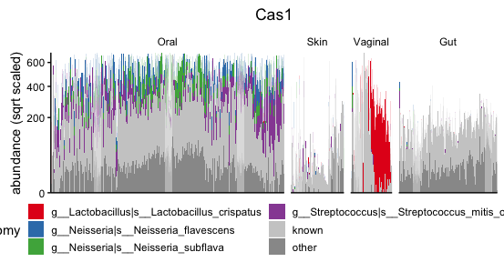

[](https://travis-ci.org/philippmuench/PMtools)
[](https://codecov.io/gh/philippmuench/PMtools)
[](https://www.gnu.org/licenses/agpl-3.0)

# PMtools

Miscellaneous helper functions mostly for comparative genomics, metagenomics and package development from P. Münch at LMU Munich & Helmholtz Centre for Infection Research.

```r
install.packages("devtools")
devtools::install_github("philippmuench/PMtools")
```

## usage

### HUMAnN2 tools

### generation of barplots

``` r
# load example datasets
data(humann2_table)
data(hmp1_2_metadata)
```



Command to generate a figure of a single feature. Set `num.bugs = "auto"` to automatically adjust the number of bugs needed to show 25% of RA

``` r
# generate the sample order
custom.order <-
  orderHumannBySimilarity(hmp1_2_metaphlan, distance.method = "bray")
# generate the data used for plotting
dat <-
  humann2Barplot(
    humann2_table,
    metadata = hmp1_2_metadata,
    feature = "Cas8",
    num.bugs = "auto",
    order.by = "custom",
    custom.order = custom.order
  )
  
# generate the plot
p <-
  makeHumann2Barplot(
    dat,
    last.plot = p,
    hide.legend = F,
    scale = "pseudolog",
    space = "fixed",
  )
# show figure
print(p$gplot)
```

and to plot multiple features in one figure

``` r
cas_plots <- vector('list', 10)
for (cas in paste0("Cas", 1:10)) {
  cas_plots[[cas]]  <- local({
    dat <-
      humann2Barplot(
        humann2_table,
        metadata = hmp1_2_metadata,
        feature = cas,
        num.bugs = "auto",
        num.bugs.explained.fraction = 0.35,
        order.by = "custom",
        custom.order = custom.order
      )
    p <-
      makeHumann2Barplot(
        dat,
        last.plot = p,
        hide.legend = F,
        scale = "pseudolog",
        space = "fixed"
        )
    print(p$gplot)
  })
}

pdf("all_cas_35_color3.pdf", width = 8, height = 9)
print(multiplot(plotlist = cas_plots, cols = 2))
dev.off()
```

## License and copyright
Copyright 2019 Philipp Münch

Source code to PMtools is made available under the terms of the [GNU Affero General Public License](LICENSE.txt) (AGPL). PMtools is distributed in the hope that it will be useful, but WITHOUT ANY WARRANTY; without even the implied warranty of MERCHANTABILITY or FITNESS FOR A PARTICULAR PURPOSE. See the GNU Affero General Public License for more details.

