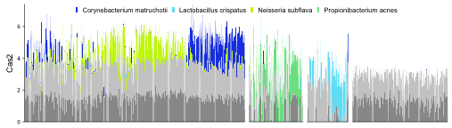

[](https://travis-ci.org/philippmuench/PMtools)
[](https://codecov.io/gh/philippmuench/PMtools)
[](https://www.gnu.org/licenses/agpl-3.0)

# PMtools

Miscellaneous helper functions mostly for comparative genomics, metagenomics and package development from P. Münch at LMU Munich & Helmholtz Centre for Infection Research.

```r
install.packages("devtools")
devtools::install_github("philippmuench/PMtools")
```

## usage

### HUMAnN2 tools

### generation of barplots

command used to generate Cas figures:

``` r
library(PMtools)
data(humann2_table)
data(hmp1_2_metadata)
for (feature in paste0("Cas", 1:10)){
  dat <- humann2Barplot(humann2_table, metadata = hmp1_2_metadata, feature = feature, num.bugs = 3, order.by = "bc")
  p <- makeHumann2Barplot(dat, hide.legend = F, scale = "sqrt")
  pdf(file =  paste0(feature, ".pdf"), width = 3.5, height = 2)
  print(p)
  dev.off()
}
```



## License and copyright
Copyright 2019 Philipp Münch

Source code to PMtools is made available under the terms of the [GNU Affero General Public License](LICENSE.txt) (AGPL). PMtools is distributed in the hope that it will be useful, but WITHOUT ANY WARRANTY; without even the implied warranty of MERCHANTABILITY or FITNESS FOR A PARTICULAR PURPOSE. See the GNU Affero General Public License for more details.

